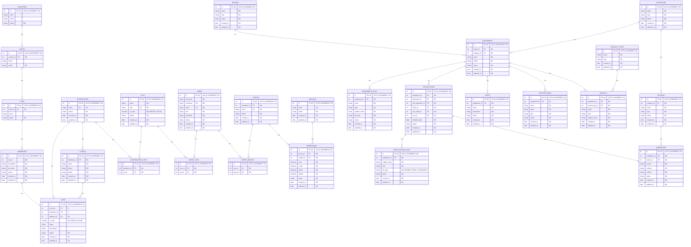

# Diagrama entidad-relación

```mermaid
    erDiagram
        COUNTRIES {
            int id PK, UK "AUTO_INCREMENT, NN"
            string code
            string name
            string status "NN"
        }

        STATES {
            int id PK, UK "AUTO_INCREMENT, NN"
            int country_id FK "NN"
            string name
            string status "NN"
        }

        CITIES {
            int id PK, UK "AUTO_INCREMENT, NN"
            int state_id FK "NN"
            string name
            string status "NN"
        }

        ADDRESSES {
            int id PK, UK "AUTO_INCREMENT, NN"
            int city_id "NN"
            string description "NN"
            string zip_code "NN"
            string status "NN"
            date created_at "NN"
            date updated_at "NN"
        }

        DISTRIBUTORS {
            int id PK, UK "AUTO_INCREMENT, NN"
            string name UK "NN"
            string status "NN"
            date created_at "NN"
            date updated_at "NN"
        }

        DISTRIBUTORS_LISTS {
            int id PK, UK "AUTO_INCREMENT, NN"
            int distributor_id FK "NN"
            int list_id FK "NN"
        }

        LISTS {
            int id PK, UK "AUTO_INCREMENT, NN"
            string name "NN"
            string slug UK "NN"
            boolean is_main "NN, DEFAULT FALSE"
            string status "NN"
            date created_at "NN"
            date updated_at "NN"
        }

        
        USERS_LISTS {
            int id PK, UK "AUTO_INCREMENT, NN"
            int user_id FK "NN"
            int list_id FK "NN"
        }

        SITES {
            int id PK, UK "AUTO_INCREMENT, NN"
            int client_id FK "N"
            int distributor_id FK "N"
            int address_id FK "NN"
            boolean is_main "NN, DEFAULT FALSE"
            string name
            string description
            string status "NN"
            date created_at "NN"
            date updated_at "NN"
        }

        CLIENTS {
            int id PK, UK "AUTO_INCREMENT, NN"
            int distributor_id FK "NN"
            string name "NN"
            string phone "NN"
            string status "NN"
            date created_at "NN"
            date updated_at "NN"
        }

        USERS {
            int id PK, UK "AUTO_INCREMENT, NN"
            string full_name "NN"
            string username UK "NN"
            string email UK "NN"
            string role "NN"
            string password "NN"
            string status "NN"
            date created_at "NN"
            date updated_at "NN"
        }

        USERS_GROUPS {
            int id PK, UK "AUTO_INCREMENT, NN"
            int user_id FK "NN"
            int group_id FK "NN"
        }

        GROUPS {
            int id PK, UK "AUTO_INCREMENT, NN"
            int distributor_id FK "NN"
            string name UK "NN"
            string status "NN"
            date created_at "NN"
            date updated_at "NN"
        }

        PERMISSIONS {
            int id PK, UK "AUTO_INCREMENT, NN"
            int group_id FK "NN"
            int module_id FK "NN"
            boolean read "NN"
            boolean create "NN"
            boolean delete "NN"
            boolean update "NN"
            string status "NN"
            date created_at "NN"
            date updated_at "NN"
        }

        MODULES {
            int id PK, UK "AUTO_INCREMENT, NN"
            string name "NN"
            string status "NN"
            date created_at "NN"
            date updated_at "NN"
        }

        BRANDS {
            int id PK, UK "AUTO_INCREMENT, NN"
            string name "NN"
            string slug "NN"
            string status "NN"
            date created_at "NN"
            date updated_at "NN"
        }

        CATEGORIES {
            int id PK, UK "AUTO_INCREMENT, NN"
            string name "NN"
            string slug "NN"
            string status "NN"
            date created_at "NN"
            date updated_at "NN"
        }

        EQUIPMENTS {
            int id PK, UK "AUTO_INCREMENT, NN"
            int brand_id FK "NN"
            int category_id FK "NN"
            string serial "NN"
            string model "NN"
            string status "NN"
            date created_at "NN"
            date updated_at "NN"
        }

        PARTS {
            int id PK, UK "AUTO_INCREMENT, NN"
            int equipment_id FK "NN"
            string serial "NN"
            string description "NN"
            string status "NN"
            date created_at "NN"
            date updated_at "NN"
        }

        INSTALLATIONS {
            int id PK, UK "AUTO_INCREMENT, NN"
            int equipment_id FK "NN"
            int distributor_id FK "NN"
            int site_distributor_id FK "NN"
            int client_id FK "NN"
            int site_client_id FK "NN"
            int user_id FK "NN"
            date installed_date "NN"
            string status "NN"
            date created_at "NN"
            date updated_at "NN"
        }

        REASONS {
            int id PK, UK "AUTO_INCREMENT, NN"
            int category_id FK "NN"
            string name "NN"
            string slug "NN"
            string status "NN"
            date created_at "NN"
            date updated_at "NN"
        }

        WARRANTIES {
            int id PK, UK "AUTO_INCREMENT, NN"
            int installation_id FK "NN"
            int reason_id FK "NN"
            string invoice "NN"
            string problem "NN"
            string solution "NN"
            string status "NN"
            date created_at "NN"
            date updated_at "NN"
        }

        INSTALLATIONS_FILES {
            int id PK, UK "AUTO_INCREMENT, NN"
            int installation_id FK "NN"
            string original_name "NN"
            string path "NN"
            string file_type "NN, [FORMAT, SERIAL, EVIDENCES]"
            string status "NN"
            date created_at "NN"
            date updated_at "NN"
        }

        SPECIFICATIONS {
            int id PK, UK "AUTO_INCREMENT, NN"
            int equipment_id FK "NN"
            string name "NN"
            string value "NN"
            string type "NN"
            string status "NN"
            date created_at "NN"
            date updated_at "NN"
        }

        EQUIPMENTS_FILES {
            int id PK, UK "AUTO_INCREMENT, NN"
            int equipment_id FK "NN"
            string name "NN"
            string path "NN"
            string original_name "NN"
            string file_type "NN"
            string status "NN"
            date created_at "NN"
            date updated_at "NN"
        }

        MANUALS_TYPES {
            int id PK, UK "AUTO_INCREMENT, NN"
            string name "NN"
            string slug "NN"
            date created_at "NN"
            date updated_at "NN"
        }

        MANUALS {
            int id PK, UK "AUTO_INCREMENT, NN"
            int equipment_id FK "NN"
            int manual_type_id FK "NN"
            string name "NN"
            string path "NN"
            string original_name "NN"
            date created_at "NN"
            date updated_at "NN"
        }

        COUNTRIES ||--o{ STATES : has
        STATES ||--o{ CITIES : has
        CITIES ||--o{ ADDRESSES : has
        ADDRESSES ||--|| SITES : has
        DISTRIBUTORS ||--o{ SITES : has
        DISTRIBUTORS ||--o{ CLIENTS : has
        CLIENTS ||--o{ SITES : has
        DISTRIBUTORS ||--o{ DISTRIBUTORS_LISTS : has 
        BRANDS ||--o{ EQUIPMENTS : has
        LISTS ||--o{ DISTRIBUTORS_LISTS : has 
        LISTS ||--o{ USERS_LISTS : has
        USERS ||--o{ USERS_LISTS : has
        USERS ||--o{ USERS_GROUPS : has
        INSTALLATIONS ||--o{ INSTALLATIONS_FILES : has
        INSTALLATIONS ||--|| WARRANTIES : has
        GROUPS ||--o{ USERS_GROUPS : has
        GROUPS ||--o{ PERMISSIONS : has
        MODULES ||--o{ PERMISSIONS : has
        CATEGORIES ||--o{ EQUIPMENTS : has
        CATEGORIES ||--o{ REASONS : has
        EQUIPMENTS ||--o{ EQUIPMENTS_FILES : has
        EQUIPMENTS ||--o{ INSTALLATIONS : has
        EQUIPMENTS ||--o{ PARTS : has
        EQUIPMENTS ||--o{ SPECIFICATIONS : has
        REASONS ||--o{ WARRANTIES : has
        MANUALS_TYPES ||--o{ MANUALS : has
        EQUIPMENTS ||--o{ MANUALS : has
```
